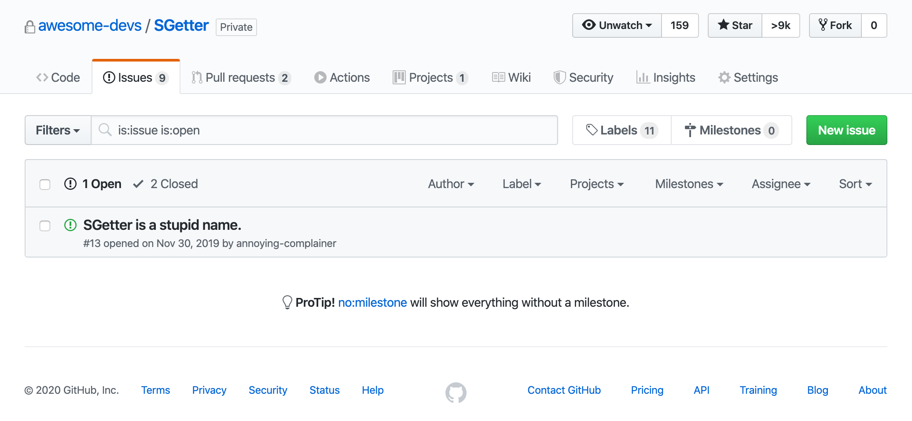

[.header: #333333, alignment(right)]

# Optics


---

#### Optics aren't any one library or tool. They're a __concept__.

#### Let's start with the basics and build up...

----

# Getters

We can write a function that gets a certain portion of an object. We'll call this a __getter__.

```typescript
const me = {
    name: "Joseph"
};

function getName(person) {
    return person.name;
}

const myName = getName(me);
```

---

# Setters

We can also write a function that sets a value or property of an object. We'll call this a __setter__.

```typescript
const me = {
    name: "Joseph"
};

function setName(newName, person) {
    return {
        ...person,
        name: newName
    };
}

const someoneElse = setName("Jim", me);
```

---

### Getters and Setters are __simple__ but __powerful__.

Because they're functions, you can nest them and their behavior is well defined.

```typescript
const me = { name: { first: "Joseph", last: "Walker" } };

// Some Getters
const getName = (person) => person.name;
const getFirstName = (name) => name.first;

// Some Setters
const setFirstName = (first, name) => ({ ...name, first });
const setName = (name, person) => ({ ...person, name });

// Combine them
const myName = getFirstName(getName(me));
const myBrother = setName(setFirstName("Jim", getName(me)), me);
```

---

### And since nesting pure functions is equivalent to __composition__...

We can combine them in an idiomatic way.[^1].

```typescript
// Get the name, then get the first name
const getFirstName = compose(
    getName,
    getFirstName
);

const myName = getFirstName(me); // Joseph
```

[^1]: Setters can be composed too, but they have to be curried first.

---

### We can build a wrapper for convenience.

Let's call it a getter-setter -- a __SGetter__.

```typescript
class SGetter {
    constructor(getter, setter) {
        this.getter = getter;
        this.setter = setter;
    }

    get(target) { return this.getter(target); }

    set(newValue, target) { return this.setter(newValue, target); }
}

const nameSgetter = new SGetter(getName, setName);

const myName = nameSgetter.get(me);
```

---

### We can add some helpers and utilities

```typescript
class SGetter {
    // Create a SGetter from a prop
    static fromProp(propName) {
        // ...
    }

    // Create a SGetter from an array of props
    static fromPath(propPath) {
        // ...
    }

    // Combine our setter and getter
    compose(nextSGetter) {
        // ...
    }
}

// For example...
const myLastName = SGetter
    .fromProp('name')
    .compose(Sgetter.fromProp('last'))
```

---

[.background-color: rgba(0, 0, 0)]



---

So let's call it...

---

[.header: alignment(center)]

# Lens

---

### A lens encodes a __getter__ and __setter__

#### It can be a _class_. Or it can be a set of _functions_.

#### All that matters is that the implementation follows...

---

### The 3 Lens Laws

- Law 1: __Get-Put__
If you _modify_ something by changing its supbart to what it _already is_... Nothing happens.

```typescript
setPart(getPart(target), target) === target
```

- Law 2: __Put-Get__
If you _modify_ something by inserting a subpart and then _view_ the result, you'll get back the inserted part.

```typescript
getPart(setPart(newValue, target)) === newValue
```

- Law 3: __Put-Put__
If you _modify_ something by inserting some part _a_, then do it again with part _b_, it's exactly the same as if you only did the second part.

```typescript
setPart(valueB, setPart(valueA, target)) === setPart(valueB, target)
```

---

### Examples using Ramda

```typescript
import * as R from 'ramda';

const me = {
    name: 'Joseph',
    occupation: 'Programmer'
}

const nameLens = R.lensProp('name');

// Using a Lens
R.set(nameLens, 'Walker', me); // { name: 'Walker', ... }

// You can modify a value using lenses too
R.over(nameLens, s => s.split(''), me); // { name: ['J', 'o', 's', ...], ... }

// Get-Put Law
R.set(nameLens, R.view(nameLens, me), me); // === me

// Put-Get Law
R.view(nameLens, R.set(nameLens, 'Walker', me)); // 'Walker'

// Put-Put Law
R.set(nameLens, 'Walker', R.set(nameLens, 'Ted', me)); // { name: 'Walker', ... }
```

---

### Can we go __deeper__?

---

### What if we modify our get and set operations?

```typescript
// Instead of...
const getThing = source => source.thing;

// What about:
const getThing = source => source && 'thing' in source ? source.thing : null;

// And instead of...
function setThing = (newValue, source) => ({ ...source, thing: newValue });

// What about:
function setThing(newValue, source) {
    return 'thing' in source
        ? {
            ...source,
            thing: newValue
        }
        : source
}
```

---

### We've just created an __Optional__ Optic

Optionals can read and set values that may or may not exist.

Ramda Lenses are actually __Optionals__. [^2]

```typescript
// This is valid, but will return undefined
R.view(
    R.lensProp('lastName'),
    R.view(
        R.lensProp('name'),
        {}
    )
);
```

[^2]: Although Ramda lenses will _set_ values that don't exist, so its implementation is slightly different than ours.

---

### We can go __even deeper__. [^3]

[^3]: Examples from here forward will use a library called Monocole-TS instead of Ramda, since Ramda only has Lenses / Optionals.

---

### Isos [^4]

If we change our get and set to modify a value in a __reversible__ way, we've created an __Iso__ optic.

The names __get__ and __set__ don't make sense in this context, though, so we call them __get__ and __reverse-get__.

```typescript
// This is a library called Monocle-TS
const celsiusToFreedom = new Iso<number, number>(c => c * (9 / 5) + 32, f => (f - 32) * (5 / 9));

celsiusToFreedom.get(20); // 68
celsiusToFreedom.reverseGet(68); // 20
```

[^4]: Short for "Isomorphism"

---
### Isos Cont.

You can use an Iso to convert between different forms of a value (measurement units, etc.)

You can also use an Iso to transform data to make it easier to work with or inspect and set.

```typescript
// Maybe we store some value in a class, e.g. a Person class
const me: Person = new Person("Joseph", 28);

// But we have a component that wants a [name, age] tuple
// We can make a tuple that turns a Person into that tuple shape
const personToTuple = new Iso<Person, [string, number]>(
    p => [p.get('name'), p.get('age')],
    t => new Person(t[0], t[1])
);

personToTuple.get(me); // ["Joseph", 28]
personToTuple.reverseGet(["Joseph", 28]); // Person
```

---

### Traversals [^5]

We can change our get and set to iterate over arrays and create a __Traversal__ optic.

```typescript
// This instantiation uses Monocle-TS style syntax
// It reads as "Create a Traversal of numbers from a Traversable Thing, in this case array
const traversalOfNumbers = fromTraversable(array)<number>();

traversalOfNumbers.set(3)([1, 2, 3]);
// [3, 3, 3]

traversalOfNumbers.modify(n => n * 2)([1, 2, 3]);
// [2, 4, 6]
```

[^5]: As a historical footnote, traversals were "discovered" before lenses. Lenses were derived from narrowing down traversals!

---

### Prisms

If we're clever, we can even create an optic that branches: A __Prism__.

```typescript
// Focus on numbers that are even, but not odd
const evenNumberPrism = Prism.fromPredicate<number, number>(
    (a): a is number => a % 2 === 0
);

evenNumberPrism.getOption(3); // Nothing
evenNumberPrism.getOption(4); // 4
```

---

### Prisms Cont.

A Prism will __narrow a condition__, testing the focus against a predicate and returning __something__ or __nothing__.

```typescript
// For example, you can narrow a sum type
const stringPrism = Prism.fromPredicate<string | number, string>(
    (a): a is string => typeof a === 'string'
);

stringPrism.getOption(3); // Nothing
stringPrism.getOption('4'); // '4'
```

---

### Prisms Cont.

A Prism is like the Optics equivalent of an __if statement__.

This is trivial to understand for __getting__. But what about __setting__?

```typescript
// Remember our String Prism
// It "views" strings or numbers, but "focuses" on only strings
const stringPrism = Prism.fromPredicate<string | number, string>(
    (a): a is string => typeof a === 'string'
);

// === Joseph
// Because our Prism only focuses if the target is a string
stringPrism.set("Joseph")("Jim"); 

// === 28
// Because our Prism does NOT focus on numbers, so this is a no-op
stringPrism.set("Joseph")(28);

// === 3
// Even though 8 WOULD be in focus 3 isn't odd, so we're NOT in focus
evenNumberPrism.set(8)(3);
```

---

_When setting with a Prism_, the prism's condition is run against the __focus__, not the __incoming value__.

Which means a Prism can make itself fail. This is __a good thing__!

Because...

---

All of these optics, no matter how complicated, are still just __getters__ and __setters__.

---

### ...So we can __compose__ _all_ of them together!

---

### Let's say we have some __Interfaces__

```typescript
// Things to notice:

export interface Data { cities: City[] } // 1. This is a list of City

export interface City {
    name: string
    trivia?: CityTrivia // 2. This property is optional
}

export interface CityTrivia {
    population: number
    factoid: StringFactoid | HomeOfFactoid // 3. This property is a discriminated union
}

export interface StringFactoid {
    type: "string",
    fact: string
}

export interface HomeOfFactoid {
    type: "homeof",
    firstName: string,
    lastName: string
}
```

---

### And some __Data__

```typescript
export const data: Data = {
    cities: [
        {
            name: "Atlanta"
            // ATL has no trivia -- it's optional
        },
        {
            name: "Dallas",
            trivia: {
                population: 1341000,
                // The factoid is a String Factoid -- not a HomeOf Factoid
                factoid: {
                    type: "string",
                    fact: "Site of JFK assassination"
                }
            }
        }
    ]
}
```

---

_Site of the JFK assassination_ is kind of a depressing factoid.

Let's __change it__.

--- 

### When working with optics, it's easiest to build from __bottom up__.

So let's start with changing the __fact__ of a __StringFactoid__

```typescript
// Let's make a lens for a StringFactoid that focuses on the "fact" text
const stringFactoidFactLens = Lens.fromProp<StringFactoid>()('fact');

// We can use it like this:
stringFactoidFactLens
    .set("Frozen margarita machine invented here")({
        type: "string",
        fact: "Site of JFK assassination"
    })

// {
//     type: "string",
//     fact: "Frozen margarita machine invented here"
// }
```

---

Our factoids live inside of __CityTrivia__. Let's make another lens:

```typescript
// Make a lens that focuses on the "factoid" property
const cityTriviaFactoidLens = Lens.fromProp<CityTrivia>()('factoid');
```

===

But __CityTrivia.factoid__ is a _discriminated union_.

Our stringFactoidFactLens only works on _StringFactoids_ -- We need a __Prism__.

```typescript
// Given a discriminated union, focus on StringFactoids
const stringFactoidPrism = Prism.fromPredicate<StringFactoid | HomeOfFactoid, StringFactoid>(
    (a): a is StringFactoid => a.type === "string"
);

// We could define an inverse prism that focuses on HomeOfFactoids too,
// but we'll skip that for now
```

---

Let's combine the optics we have so far!

```typescript
// Composing optics together
const combinedOptic = cityTriviaFactoidLens
    .composePrism(stringFactoidPrism)
    .composeLens(stringFactoidFactLens);

// And we'd use it like this:
combinedOptic
    .set("Frozen margarita machine invented here")({
        population: 1341000,
        factoid: {
            type: "string",
            fact: "Site of JFK assassination"
        }
    })
```

---

Keep going up the chain!

A __City__ may or may not have trivia. We'll need an __Optional__ for the next step.

```typescript
// Focus on the "trivia" property of a City, if it exists
const cityTriviaOption = Optional.fromNullableProp<City>()('trivia');

// Let's add it to our chain
const combinedOptic = cityTriviaOption
    .composeLens(cityTriviaFactoidLens)
    .composePrism(stringFactoidPrism)
    .composeLens(stringFactoidFactLens);
```

---

Now we want to operate on an array of __City__. Array means we reach for __Traversal__.

```typescript
// We have an _array_ of _City_
// The syntax here being a factory function instead of a static method
// like all the other optics is a quirk of the library we're using for the examples
const citiesTraversal = fromTraversable(array)<City>();

// Toss it on the stack
const combinedOptic = citiesTraversal
    .composeOptional(cityTriviaOption)
    .composeLens(cityTriviaFactoidLens)
    .composePrism(stringFactoidPrism)
    .composeLens(stringFactoidFactLens);
```

---

Now we can construct the final piece: The __Lens__ that gets the cities from our __Data__.

```typescript
// Gets the cities prop from Data
const citiesLens = Lens.fromProp<Data>()('cities');

// Our final optic looks like this:
// 1) We focus on the cities
const finalOptic = citiesLens
    // 2) We spread our focus to every element of the cities property
    .composeTraversal(citiesTraversal)
    // 3) We focus on the trivia, but only if it's there
    .composeOptional(cityTriviaOption)
    // 4) We focus on the factoid of the trivia
    .composeLens(cityTriviaFactoidLens)
    // 5) We narrow our focus to StringFactoids
    .composePrism(stringFactoidPrism)
    // 6) We finally focus on the "fact" property
    .composeLens(stringFactoidFactLens);
```

But there's one final step...

---

Our final optic as it stands now focuses on the __fact__ of __every__ city in our data set.

We only want to update the fact for _Dallas_.

We could use a __Prism__ for this to narrow a _City_ to a _Dallas City_, but __Monocle Traversals__ have a few convenient helpers we can leverage.

---

One of them is __filter__. This is sort of like an _inline Prism_, and it follows the same "predicate" pattern.

```typescript
const finalFinalOptic = citiesLens
    .composeTraversal(citiesTraversal)
        // We call "filter" inline here. The expression we pass in will receive a City,
        // the focus of the traversal, and we can return true or false just like a normal
        // Array filter.
        .filter(c => c.name === "Dallas")
    .composeOptional(cityTriviaOption)
    .composeLens(cityTriviaFactoidLens)
    .composePrism(stringFactoidPrism)
    .composeLens(stringFactoidFactLens)
```

---

And now we're ready to update our Dallas factoid...

```typescript
finalFinalOptic.set("Frozen margarita machine invented here")(data);
// {
//     "cities": [
//         {
//             "name": "Atlanta"
//         },
//         {
//             "name": "Dallas",
//             "trivia": {
//                 "population": 1341000,
//                 "factoid": {
//                     "type": "string",
//                     "fact": "Frozen margarita machine invented here"
//                 }
//             }
//         }
//     ]
// }
```

---

### The optics that we just created are all __reusable__.

```typescript
// We have a toolbelt now:
export const citiesLens = // ...
export const citiesTraversal = // ...
export const cityTriviaOption = // ...
export const cityTriviaFactoidLens = // ...
export const stringFactoidPrism = // ...
export const stringFactoidFactLens = // ...
```

You could keep adding more optics, too. You could build a __library of optics__ around your data model.

It's similar to building a library of Redux Selectors -- but expontentially more flexible because Optics can be composed _on demand_, and can __get__ AND __set__.

---

## Optics Are:

### • Simple
### • Powerful
### • Composable
### • Immutable

---

Some Optics libraries to check out:

| __Library__        | __Optics__                            | __Comments__                                                                                                                                                           |
|----------------|-----------------------------------|--------------------------------------------------------------------------------------------------------------------------------------------------------------------|
| _Monocle_        | Lens Optional Prism Iso Traversal | Part of a larger ecosystem called "fp-ts." Documentation is not beginner friendly. Typescript First.                                                                             |
| _Ramda_          | Lens                              | Lenses exposed by Ramda are Partial. Partial Typescript support.                                                                                                   |
| _Shades_         | Lens Traversal                    | Shades technically implements other optics, but it calls them Virtual Lenses? Has full Typescript support.                                                         |
| _Partial Lenses_ | Lens Optional Prism Iso Traversal | Plays fast and loose with the lens laws in favor of providing more straightforward APIs and utilities. Claims to have near-native performance for composed lenses. |

There are many others, but these are actively maintained.

---

[.text: alignment(center)]

Questions?